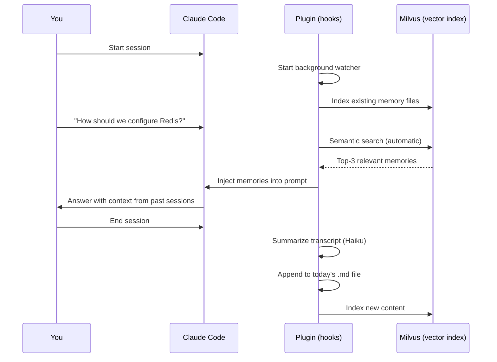
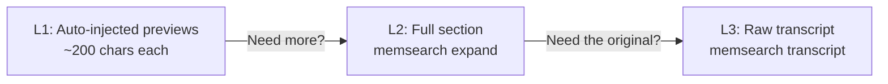

I've been using Claude Code as my primary coding assistant for a few months now. It's genuinely great — until you start a new session and it has no idea what you talked about yesterday. You find yourself re-explaining architecture decisions, re-describing bugs you already fixed, re-stating team conventions.

Claude Code *does* have a memory system: `CLAUDE.md` files and the `/memory` command. But as your project history grows, this single-file approach starts to crack. So we built a [Claude Code plugin](https://zilliztech.github.io/memsearch/claude-plugin/) that gives Claude **real persistent memory** — automatic session capture, semantic search across your entire history, and a three-layer progressive disclosure model that keeps context window usage minimal.

The plugin is built on [memsearch](https://github.com/zilliztech/memsearch), an open-source memory search library backed by Milvus. In this post I'll walk through why we built the plugin, how it works, and how it compares to Claude Code's native memory and another popular solution called [claude-mem](https://github.com/thedotmack/claude-mem).

## The Problem with CLAUDE.md

Claude Code's built-in memory works like this: there's a `CLAUDE.md` file at your project root. You write stuff in it, and Claude sees it at the start of every session. Simple and effective — for a while.

Here's what happens over time:

| Week 1 | Week 8 |
|--------|--------|
| CLAUDE.md is 20 lines | CLAUDE.md is 400+ lines |
| Everything is relevant | 90% is noise for any given task |
| Loads instantly | Eats a chunk of your context window |
| Easy to maintain | Nobody wants to prune it |

The fundamental issue is that `CLAUDE.md` has **no search**. It loads everything or nothing. Claude can't selectively recall "what was that Redis config decision from two weeks ago?" — it either happens to be in the file, or it's gone.

And if you're using the `/memory` command to auto-append, the file grows monotonically. There's no dedup, no summarization, no relevance filtering.

## How the Plugin Works

Once installed, the plugin runs entirely in the background. You don't need to learn any new commands — just use Claude Code normally, and it remembers.

Your memory lives in daily markdown files:

```
your-project/
├── .memsearch/
│   └── memory/
│       ├── 2026-02-07.md     ← daily session log
│       ├── 2026-02-08.md
│       └── 2026-02-09.md
└── ... (your project files)
```

Each daily file contains bullet-point summaries of what happened in each Claude Code session. These are generated **automatically** — when you end a session, a hook summarizes the conversation using Haiku and appends it to today's file.

The full lifecycle:



The plugin is built entirely on Claude Code's own primitives — **Hooks** for lifecycle events and **CLI** for tool access. No MCP servers, no sidecar services. Everything runs locally as shell scripts calling the `memsearch` CLI.

The three key hooks:

1. **SessionStart** — spins up a background file watcher and indexes any existing memory files.

2. **UserPromptSubmit** — fires on every message you send. Runs semantic search and injects the top-3 relevant memories *before* Claude processes your message. No tool call needed, no "should I look up my memory?" decision.

3. **Stop** — fires when you close a session. Parses the conversation transcript, calls Haiku for a bullet-point summary, and writes it to `memory/YYYY-MM-DD.md`.

Because the memory files are plain markdown, you can read, edit, `grep`, and `git diff` them. The vector index is just a derived cache — blow it away and run `memsearch index` to rebuild in seconds.

## Progressive Disclosure: Three Layers of Context

This is the part I'm most excited about. Dumping all relevant memories into the prompt would waste the context window. Showing only tiny snippets might not be enough. So the plugin uses a three-layer approach:



**Layer 1** is fully automatic. On every prompt, Claude gets something like this:

```
## Relevant Memories
- [memory/2026-02-08.md:14:30]  Implemented two-tier caching: Redis L1
  with 5min TTL, in-process LRU L2 with 1000 entry cap. Cache invalidation
  via Redis pub/sub...
  `chunk_hash: 47b5475122b992b6`
```

Short previews. Enough for most follow-ups. ~200 characters per chunk, 3 chunks injected. Minimal context cost.

**Layer 2** — when the preview isn't enough, Claude runs:

```bash
$ memsearch expand 47b5475122b992b6
```

This returns the full markdown section, including neighboring headings and the session anchor metadata. Claude now sees the complete bullet list and surrounding context from that day.

**Layer 3** — when Claude needs the *exact* code or error message from a past session, it can drill into the raw transcript:

```bash
$ memsearch transcript /path/to/session.jsonl --turn 6d6210b7 --context 2
```

This pulls the original conversation turns — user messages, assistant responses, tool calls, everything. We rarely see Claude go to L3 unprompted, but when you ask "what was the exact error message from yesterday's deploy?", it knows the path.

The beauty is that **L1 handles ~80% of cases** with near-zero context cost. L2 and L3 are there for the remaining 20% and only get invoked when needed.

## Comparison: the Plugin vs. CLAUDE.md vs. claude-mem

There are three approaches to Claude Code memory today. Here's an honest comparison:

| | CLAUDE.md | claude-mem | memsearch plugin |
|---|-----------|------------|-----------|
| **How memory is recalled** | Entire file loaded at session start | Claude calls MCP search tool | Hook auto-injects top-k results |
| **Recall is...** | Always-on but unfiltered | On-demand (Claude must decide to search) | Always-on and filtered by relevance |
| **Storage format** | Single monolithic file | SQLite + Chroma (binary) | Daily `.md` files (human-readable) |
| **Search capability** | None | Dense vector search | Hybrid search (dense + BM25) |
| **History depth** | Limited to one file | Unlimited | Unlimited |
| **Automatic capture** | Manual (`/memory` command) | Automatic observations | Automatic session summaries |
| **Context window cost** | Grows linearly with file size | MCP tool definitions always loaded | Minimal — only top-k snippets |
| **Progressive disclosure** | None | 3-layer, all agent-driven | 3-layer, L1 is automatic |
| **Can rebuild index?** | N/A | No — Chroma is the data store | Yes — markdown is the source of truth |
| **Git-friendly?** | Yes (single file) | No (binary data) | Yes (one `.md` per day) |

### Push vs. Pull — the Key Difference

The biggest differentiator between the memsearch plugin and claude-mem is **push vs. pull**.

claude-mem gives Claude MCP tools to search, explore timelines, and fetch observations. All three layers require Claude to *decide* to use them. In practice, Claude often doesn't call the search tool unless the conversation explicitly references past work. Relevant context gets silently missed.

The memsearch plugin **pushes** memories to Claude before every message. Claude doesn't need to decide whether to look things up — it just *has* the relevant context. This is a subtle but important difference. After using both approaches, we found that automatic injection catches context that agent-driven recall misses maybe 30-40% of the time.

### Why Not Just a Bigger CLAUDE.md?

You might think: "I'll just keep my CLAUDE.md small and curated." That works if you're disciplined, but it means manually deciding what's worth remembering. The plugin captures everything automatically and lets semantic search handle the filtering. Three weeks from now, when you ask Claude about that obscure config decision you forgot to write down, it'll be there.

## Quick Start

```bash
# 1. Install the memsearch CLI
pip install memsearch

# 2. Set your embedding API key
export OPENAI_API_KEY="sk-..."

# 3. In Claude Code, add the plugin marketplace and install
/plugin marketplace add zilliztech/memsearch
/plugin install memsearch

# 4. Restart Claude Code for the plugin to take effect
```

That's it. From now on:

- Every session is automatically summarized and saved
- Every prompt gets relevant memories injected
- Your memory lives in `.memsearch/memory/*.md` — browse it anytime

No new commands to learn. No workflow changes. Just start using Claude Code and it remembers.

## What's Next

We're actively working on the plugin and would love feedback. Some things on the roadmap:

- **Memory compaction** — LLM-powered summarization to compress old memories (already in progress)
- **Multi-agent shared memory** — point multiple Claude Code instances at the same Milvus server
- **Smarter L1 injection** — adjusting the number of injected results based on query relevance scores

The plugin is fully open source as part of the memsearch project: **[github.com/zilliztech/memsearch](https://github.com/zilliztech/memsearch)**

Full plugin docs with the progressive disclosure deep-dive: **[zilliztech.github.io/memsearch/claude-plugin/](https://zilliztech.github.io/memsearch/claude-plugin/)**

If you're using Claude Code and have been frustrated by the memory gap between sessions, give it a try. And if you've built your own memory solution, I'd genuinely love to hear about your approach — this is still a very unsettled design space.
